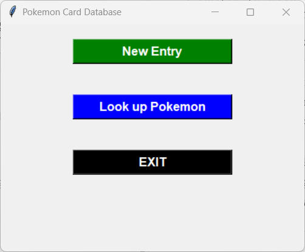
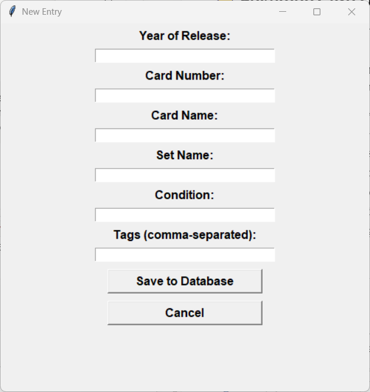
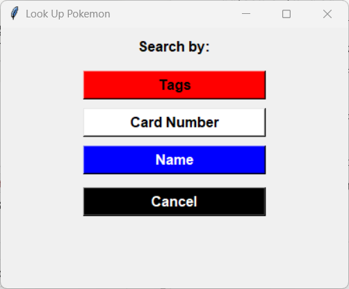
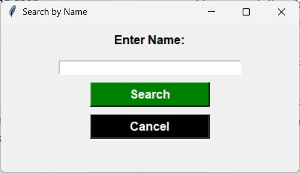

<div align="center">

# 🗃️ Pokémon Card Database GUI

**A slick desktop app for cataloging your Pokémon card collection.** 🃏

Add, search, and edit card entries through a simple Tkinter interface — all saved locally to a text file.

<table>
  <tr>
    <td align="center"></td>
    <td width="20"></td>
    <td align="center"></td>
  </tr>
  <tr><td colspan="3" height="20"></td></tr>
  <tr>
    <td align="center"></td>
    <td width="20"></td>
    <td align="center"></td>
  </tr>
</table>

</div>

---

## ✨ Features

| | |
|---|---|
| ➕ **Add New Card Entries** | Enter details like year, card number, name, set, condition, and tags |
| 🔍 **Search for Cards** | Search by tags, card number, or name |
| ✏️ **Edit Card Details** | Modify details of existing cards |
| 💾 **Persistent Storage** | Saves card details to a text file on your desktop (`cards_list.txt`) |
| 🖱️ **User-Friendly GUI** | Simple and intuitive interface built with Tkinter |

---

## 🚀 Getting Started

### Requirements

- 🐍 Python 3.x
- 🪟 Tkinter (usually included with Python)

### Installation

1. **Clone the repo** (or download the script file)
   ```bash
   git clone https://github.com/moturkmani/pokemon-card-database.git
   cd pokemon-card-database
   ```

2. **Run it**
   ```bash
   python card_database.py
   ```

---

## 📖 Usage

1. **🏠 Main Menu** — choose to add a new entry, look up a Pokémon card, or exit the application
2. **➕ New Entry** — fill out all fields to add a new card to the database
3. **🔍 Search** — search for cards by tags, card number, or name
4. **✏️ Edit** — select a search result to edit its details

---

## 🧩 Code Highlights

- **📂 Centralized Database Management**
  - All card data is saved in a text file for simplicity
  - Entries are formatted for easy reading and editing

- **📱 Responsive UI**
  - Windows are dynamically centered and sized
  - Buttons and labels are styled for clear navigation

- **🔎 Search and Edit Functionalities**
  - Search results are displayed as buttons for quick access
  - Edit window allows full modification of card details

---

## 📋 Example Entry Format

When a card is saved, it's stored in the following format:

```
Year: 2023  Card Number: 001  Card Name: Pikachu  Set Name: Base Set  Condition: Mint  Tags: Electric, Rare
```

---

## 🖼️ Screenshots

| Screen | Description |
|---|---|
| 🏠 **Main Menu** | Add new cards, search, or exit |
| ➕ **Add New Entry** | Form fields for detailed card information |
| 🔍 **Search** | Search by tags, card number, or name and display results |
| ✏️ **Edit Entry** | Modify and save existing card details |

---

## 🙏 Acknowledgments

Special thanks to the Pokémon community for inspiration! ⚡

---

<div align="center">

Start organizing your Pokémon card collection today with this simple and effective database tool! 🎴✨

</div>
